# Travel-Management-System

Travel Management System 🌍🚀

Overview

The Travel Management System is a web-based platform designed to streamline the process of booking and managing travel services. It caters to both users (travelers) and administrators, allowing users to book trips, view travel history, and make payments, while admins manage bookings, destinations, and user queries.
Built using React.js for the frontend, Node.js & Express.js for the backend, and MongoDB as the database, this system provides a seamless and efficient travel management experience.
Features

For Users (Travelers):
✅ User Registration & Authentication – Secure login and account creation
✅ Browse Destinations – View available travel destinations & packages
✅ Book Trips – Reserve travel packages with flexible options
✅ Manage Bookings – View upcoming & past trips, cancel if needed
✅ Payment Integration – Secure online payments (Stripe/PayPal)
✅ Reviews & Ratings – Rate destinations and share feedback
✅ Support & Queries – Contact support for travel assistance
For Admins:
✅ Admin Dashboard – View system statistics and analytics
✅ Manage Users – View and manage registered users
✅ Add/Edit Travel Packages – Create, update, and remove trips
✅ Booking Management – Approve or reject user bookings
✅ Track Payments – View and manage transactions
✅ Customer Support – Handle user queries and feedback
Technology Stack

Frontend (Client-Side) 🖥
React.js (with React Router for navigation)
Redux (for state management)
Axios (for API calls)
Bootstrap / TailwindCSS (for UI styling)
Backend (Server-Side) ⚙️
Node.js & Express.js (RESTful API)
JWT Authentication (for secure access)
Mongoose (MongoDB ORM)
Database 🗄
MongoDB (NoSQL database for storing users, bookings, and trips)
Nodemailer (For sending booking confirmations & alerts)

## Screenshots

### User
Home Page  
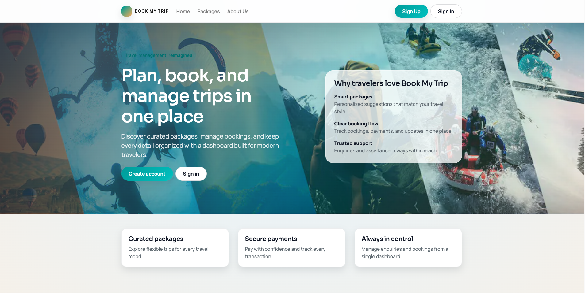

User Sign In  

Packages List  
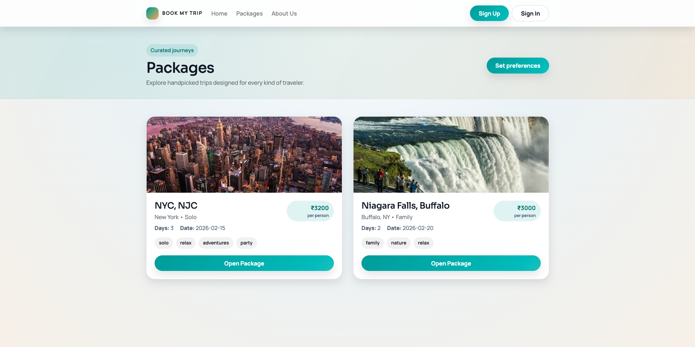

Package Details  
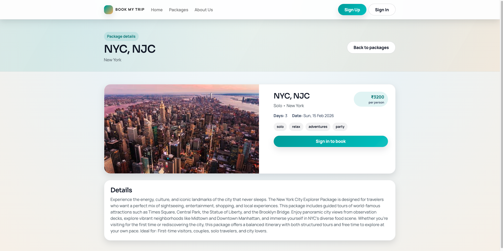

Booking Page  
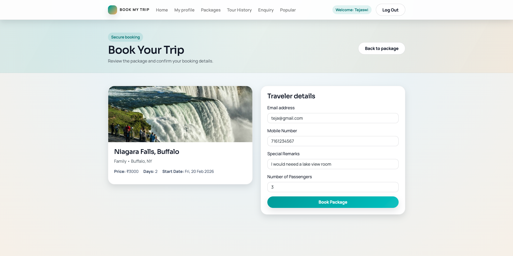

Payment Page  
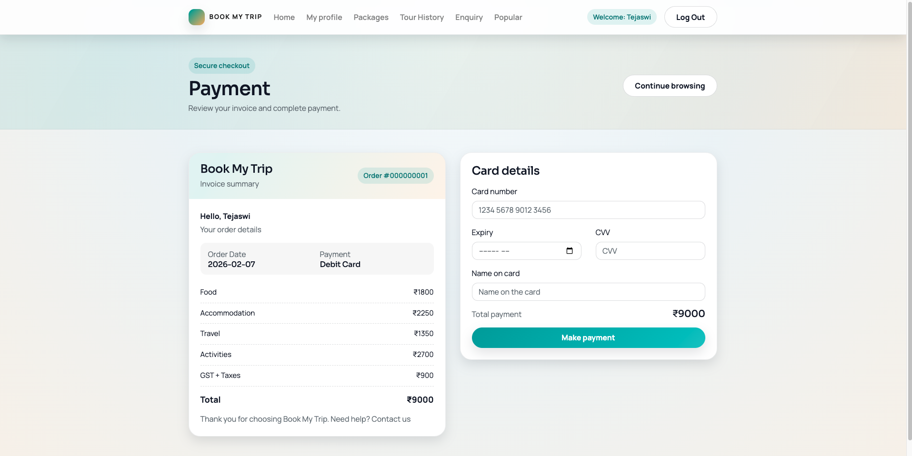

Tour History  
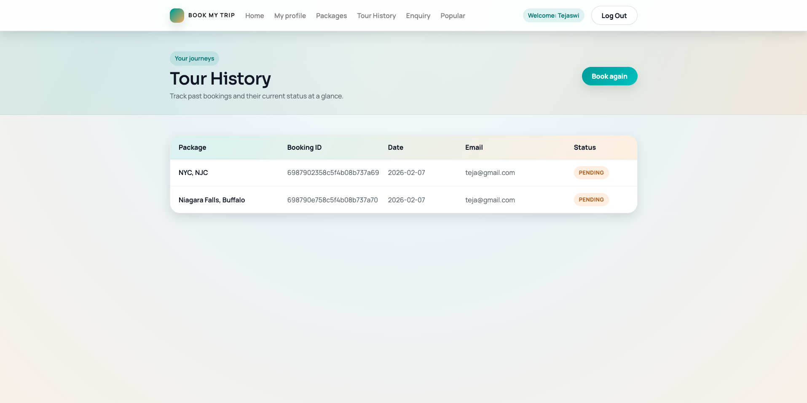

Enquiries  

### Admin
Dashboard  
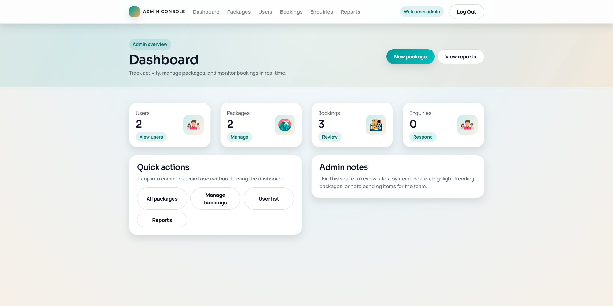

Packages Management  
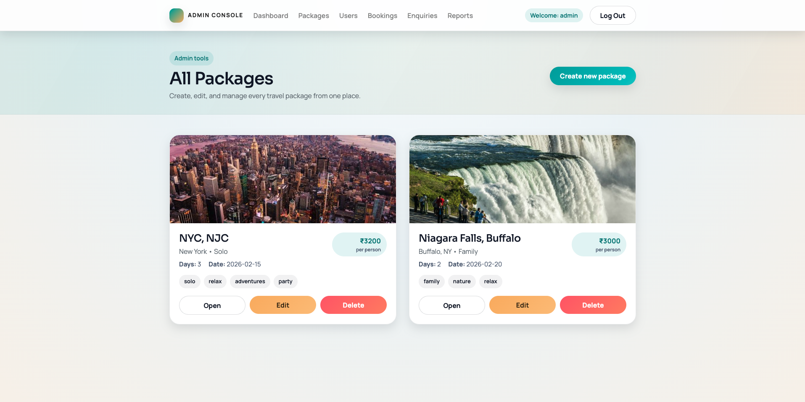

Create New Package  
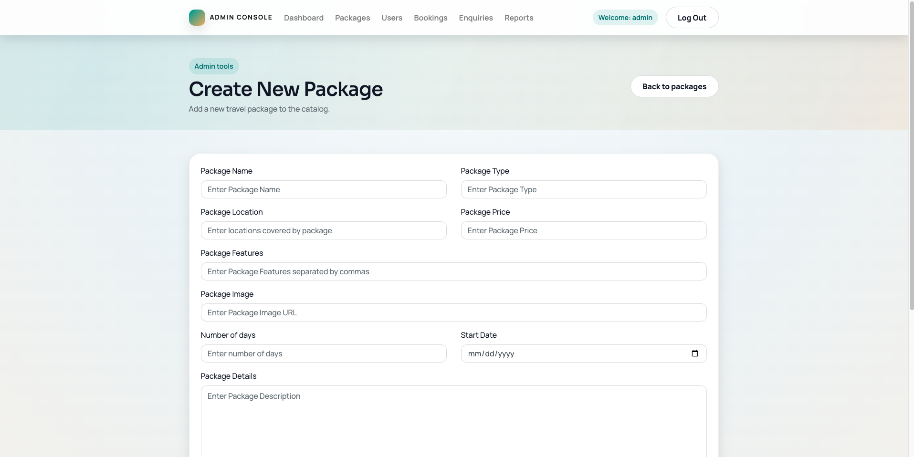

Bookings  
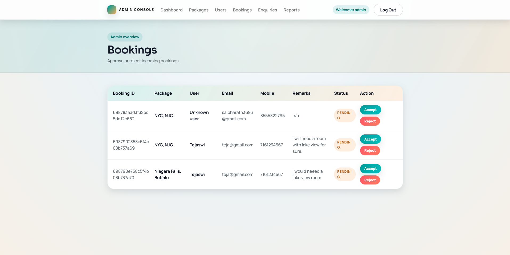

Users Management  
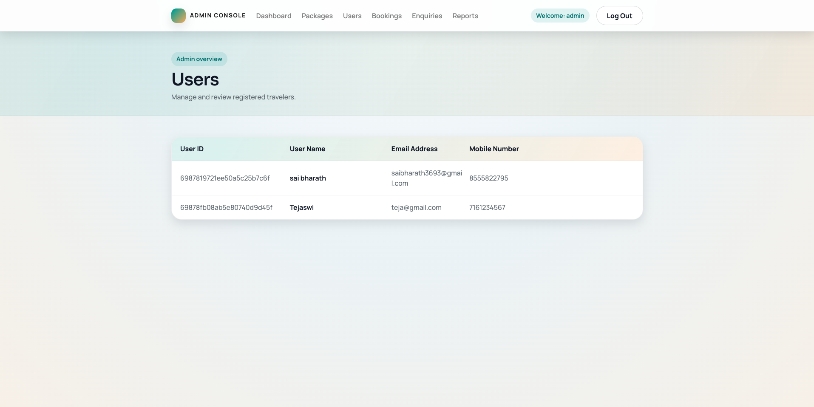

Reports  
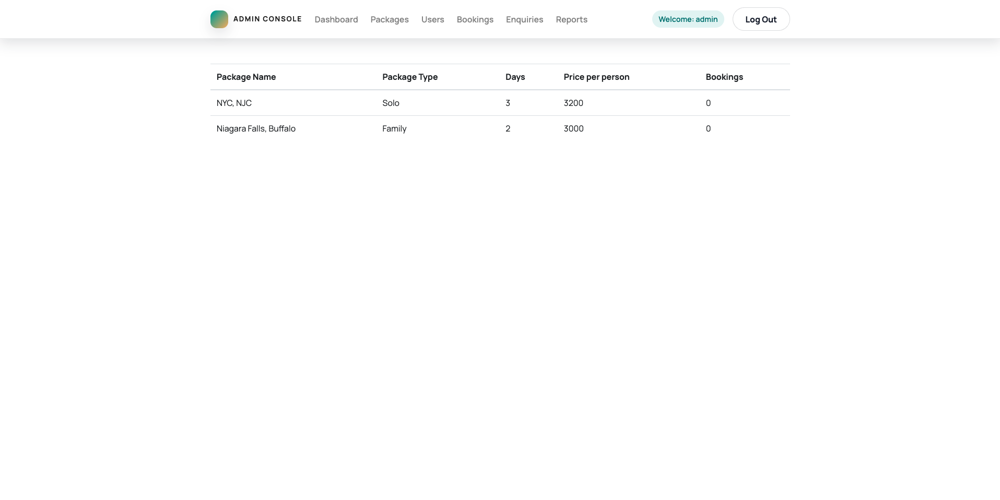
