# Travel-Management-System

Travel Management System 🌍🚀

Overview

The Travel Management System is a web-based platform designed to streamline the process of booking and managing travel services. It caters to both users (travelers) and administrators, allowing users to book trips, view travel history, and make payments, while admins manage bookings, destinations, and user queries.
Built using React.js for the frontend, Node.js & Express.js for the backend, and MongoDB as the database, this system provides a seamless and efficient travel management experience.
Features

For Users (Travelers):
✅ User Registration & Authentication – Secure login and account creation
✅ Browse Destinations – View available travel destinations & packages
✅ Book Trips – Reserve travel packages with flexible options
✅ Manage Bookings – View upcoming & past trips, cancel if needed
✅ Payment Integration – Secure online payments (Stripe/PayPal)
✅ Reviews & Ratings – Rate destinations and share feedback
✅ Support & Queries – Contact support for travel assistance
For Admins:
✅ Admin Dashboard – View system statistics and analytics
✅ Manage Users – View and manage registered users
✅ Add/Edit Travel Packages – Create, update, and remove trips
✅ Booking Management – Approve or reject user bookings
✅ Track Payments – View and manage transactions
✅ Customer Support – Handle user queries and feedback
Technology Stack

Frontend (Client-Side) 🖥
React.js (with React Router for navigation)
Redux (for state management)
Axios (for API calls)
Bootstrap / TailwindCSS (for UI styling)
Backend (Server-Side) ⚙️
Node.js & Express.js (RESTful API)
JWT Authentication (for secure access)
Mongoose (MongoDB ORM)
Database 🗄
MongoDB (NoSQL database for storing users, bookings, and trips)
Nodemailer (For sending booking confirmations & alerts)

2. 3 User Interfaces
Home Page:
Fig.2. 3.1

This is the home page where a new user can create an account by signing up and the
user can sign in to their account if already created.

User Sign Up Page:
Fig. 2. 3. 2
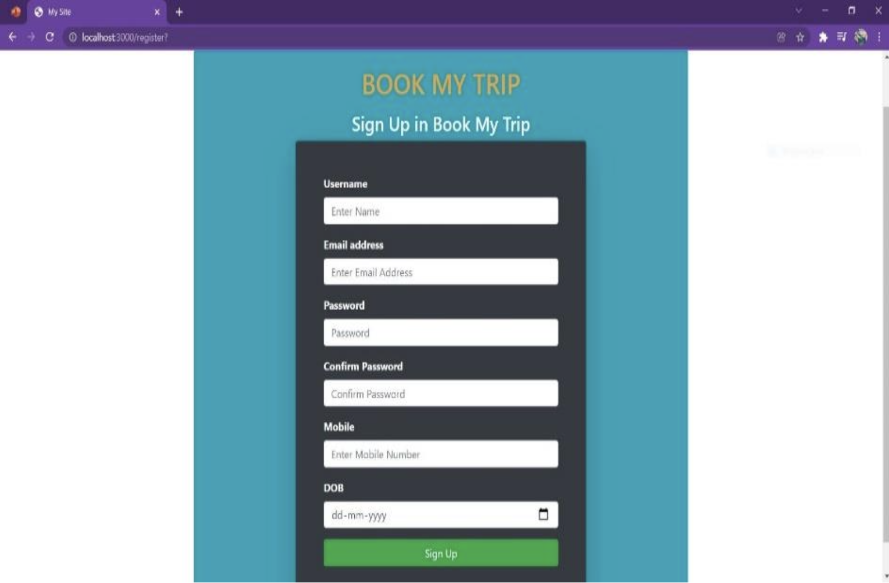

This is the User sign up page where the User can sign up by entering the details like
username, email and mobile and date of birth, if the user doesn’t have an account.

User Login page:
Fig.2. 3.3
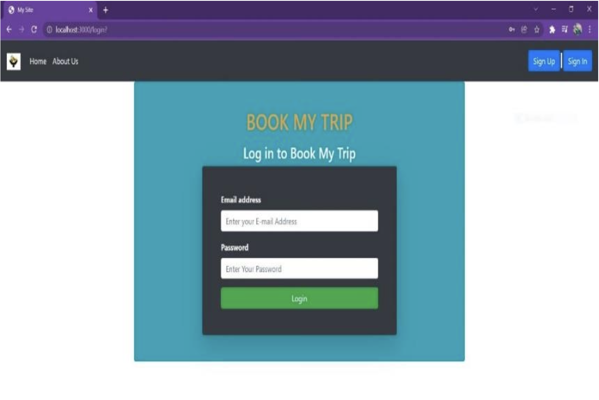

This is the User login page where the user login to their account.

User Dashboard:
Fig.2.3.4
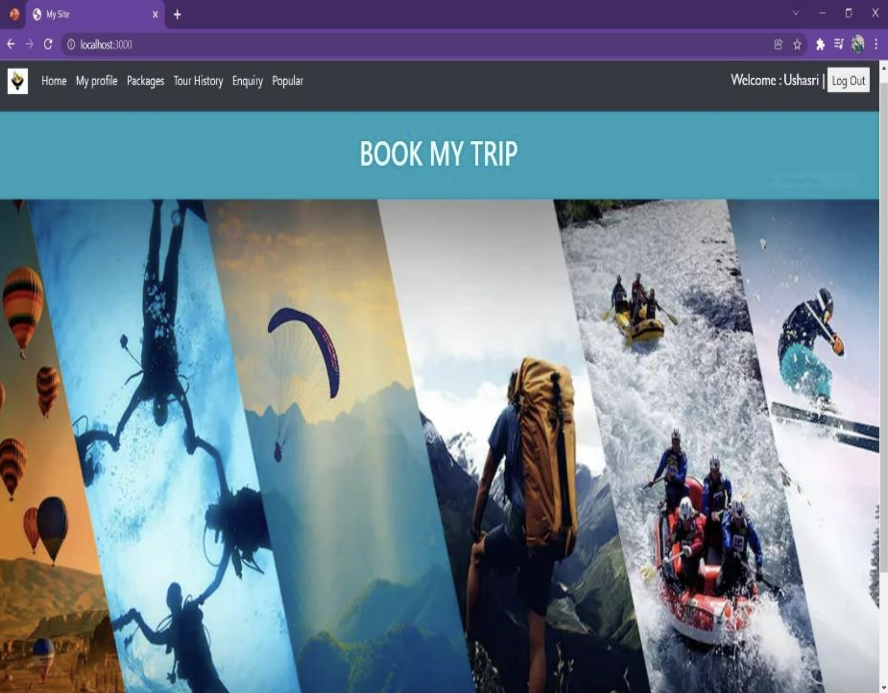

This is the User dash board redirects when the user successfully creates/logins into their
account, here user can go to their profile , browse packages, write enquiry and check
their tour history.

User Profile Page:
Fig. 2. 3.5
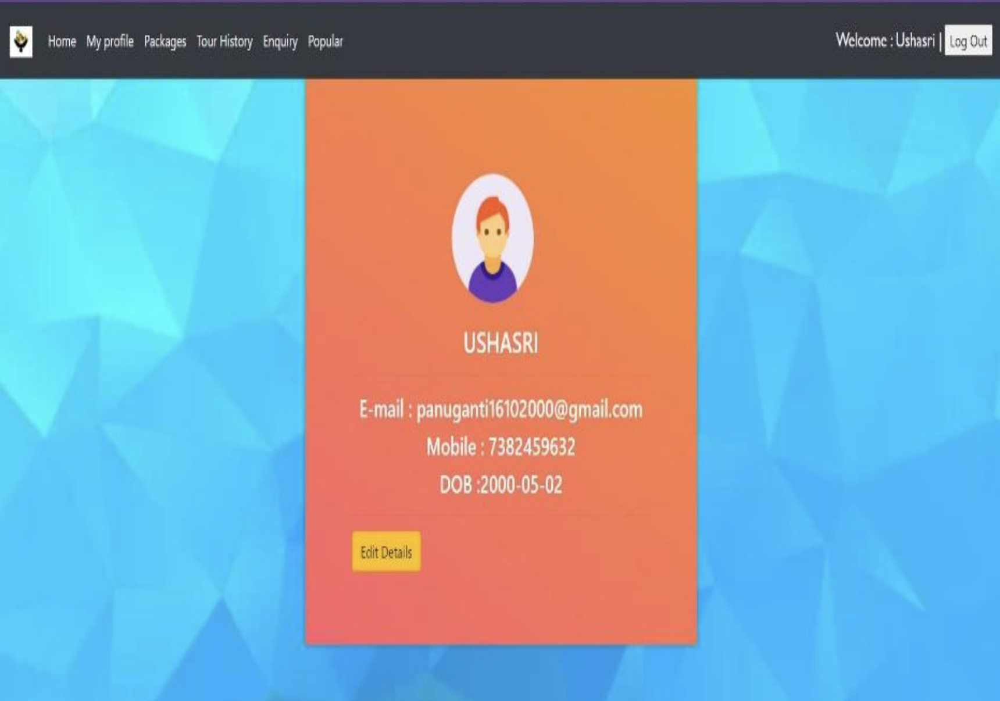

This is the User’s profile where they find the edit details button hence, by clicking they
can edit their details when necessary.

Packages List:
Fig.2. 3.6
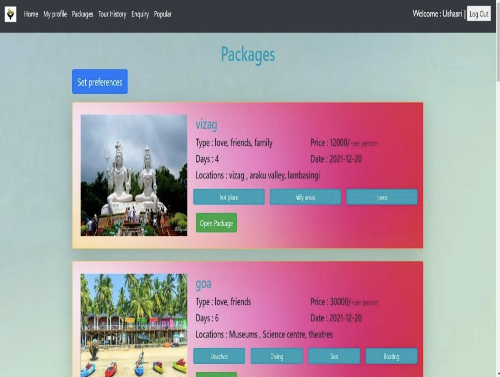

This is the Packages list where user find packages to browse and also preferences button
to set preferences, after setting based on their preferences packages list is shown.

Preferences List:
Fig.2. 3.7
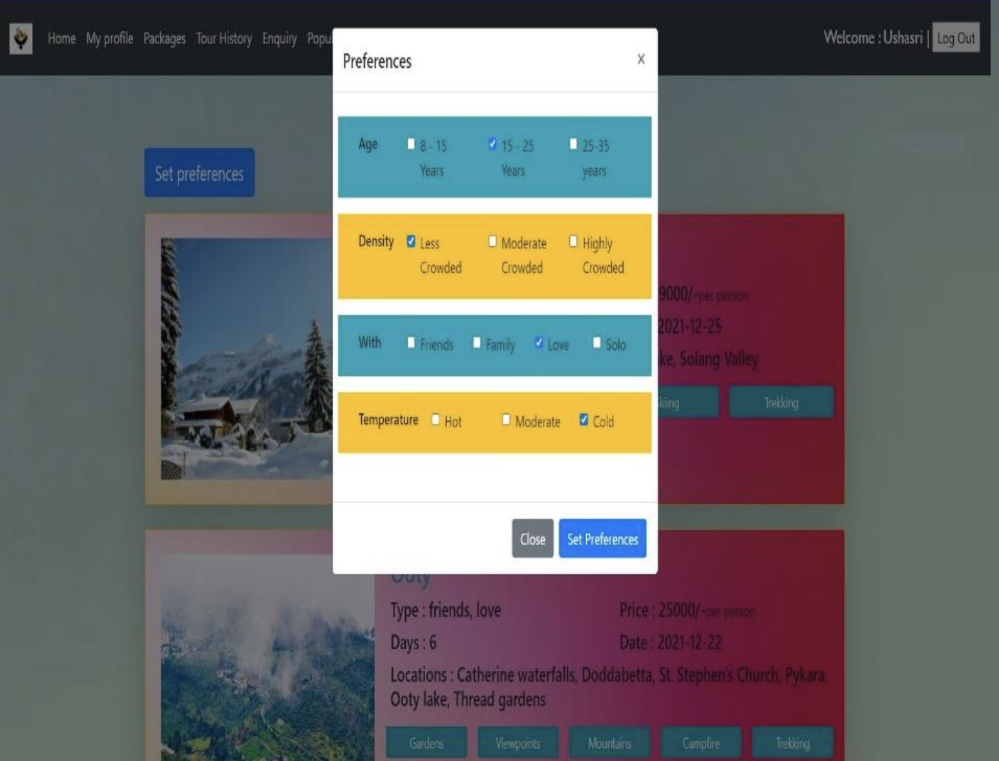

This is the Preferences page where the user can set their preferences.
Packages List After Preferences set:
Fig. 2. 3.8
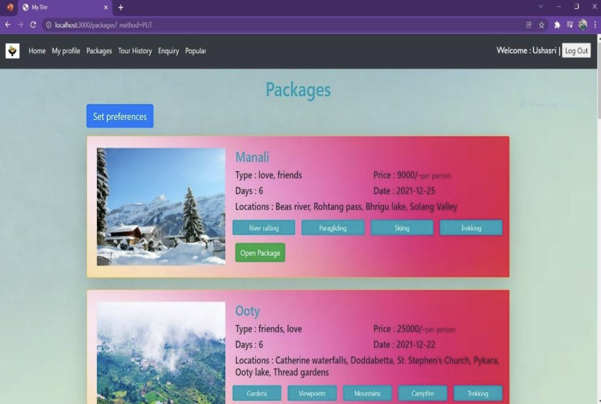

This is the Packages list page where the user can browse packages list after setting
their preferences.

Tour History Page:
Fig. 2. 3.9
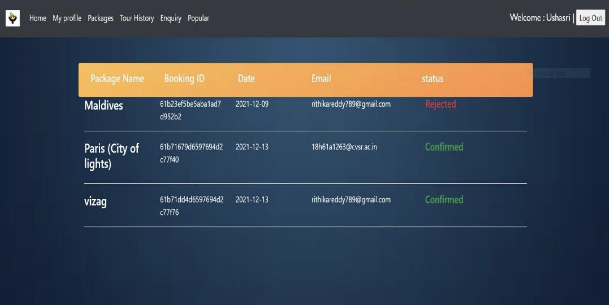

This is the Tour history page where the user can find their tour history and also know

whether their tour status.
User Enquiries Page:
Fig. 2. 3.10
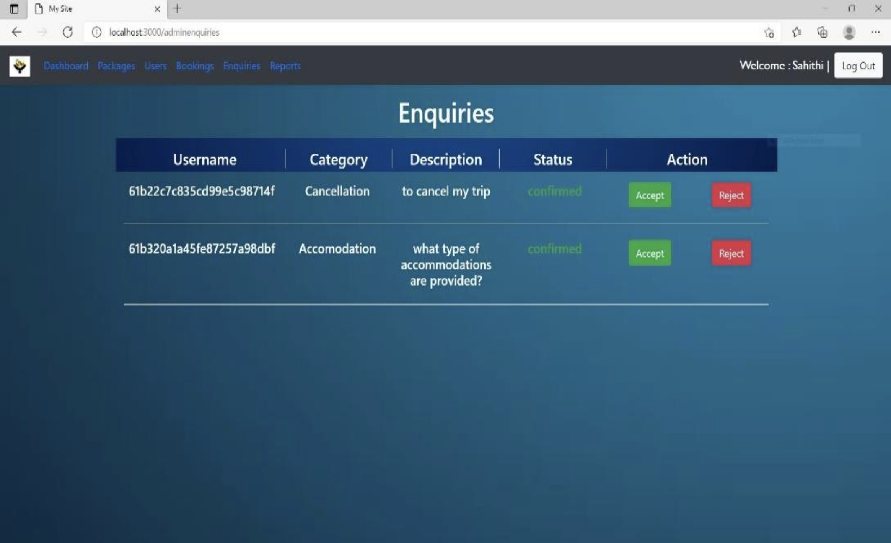

This is the User enquiries page where the user can know about their enquiries.

Popular Packages List:
Fig. 2. 3.11
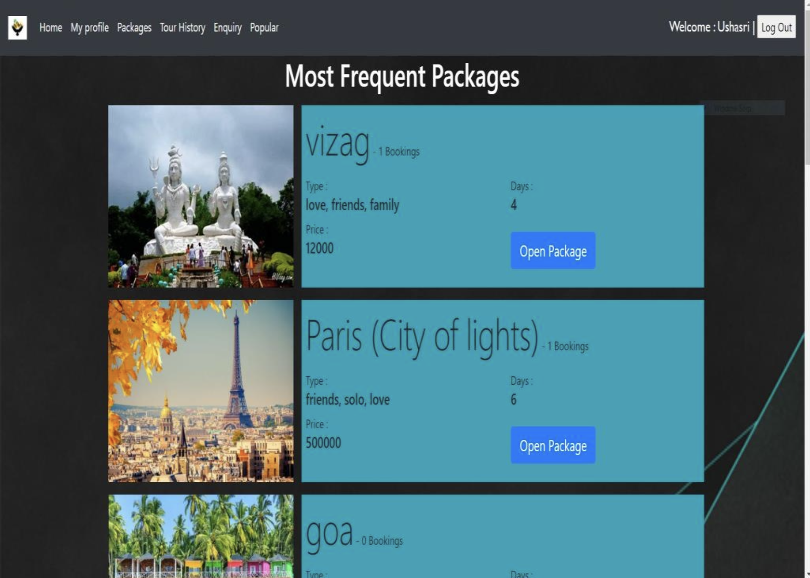

This is the frequently booked packages list which helps the user to know the most

popular packages.

Admin Login Page:
Fig. 2. 3.12
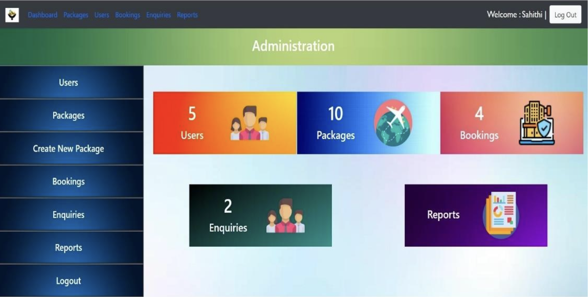

This is the admin login page where the admin can login in to their account.
Admin Home Page:
Fig. 2. 3.13

This is the admin dashboard where admin can find the number of users, number of

bookings, number of enquiries, also users details and booking details.
Admin Side Packages List:
Fig. 2. 3.14
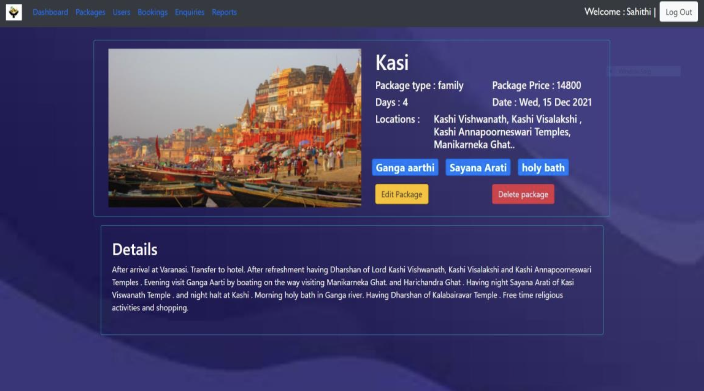

This is the admin side packages list page where the admin can browse packages list.
Package Page:
Fig. 2. 3.15
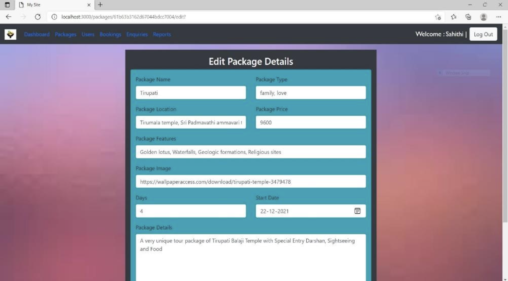

This is the Package details page where the admin can know about package(name, type,

features, price).
Edit Package Page:
Fig.2. 3.16
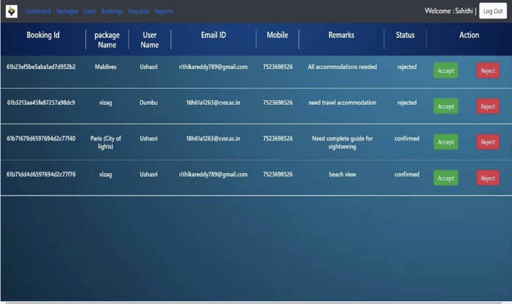

This is the Edit package details page redirected when edit package button is clicked in
package details, where the admin can edit the package details.

Admin Enquiries Page:
Fig. 2. 3.17
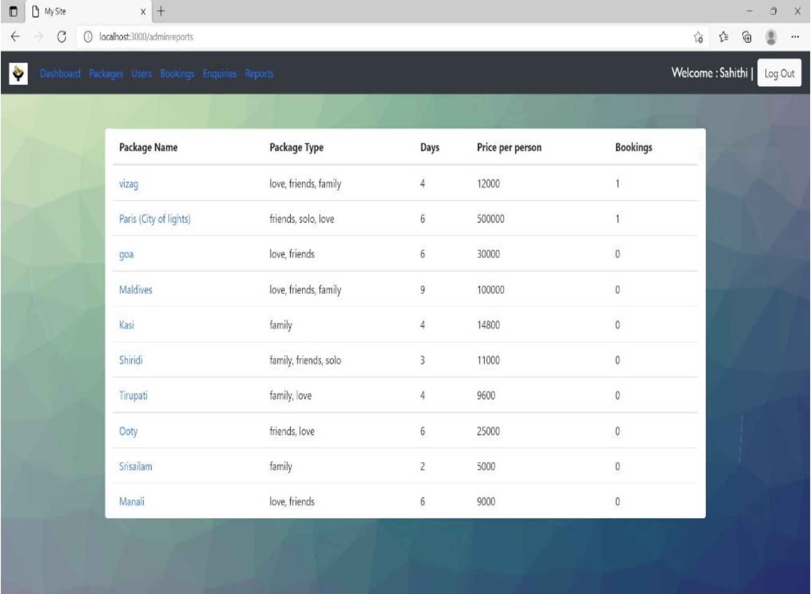

This is the admin enquiries page where admin can manage the enquiries raised by the
users of the application.

Admin Reports Page:
Fig.2. 3. 18
This is the admin reports page where the admin can know about number of bookings of

each package.
This is a offline tool, your data stays locally and is not send to any server!
Feedback & Bug Reports
